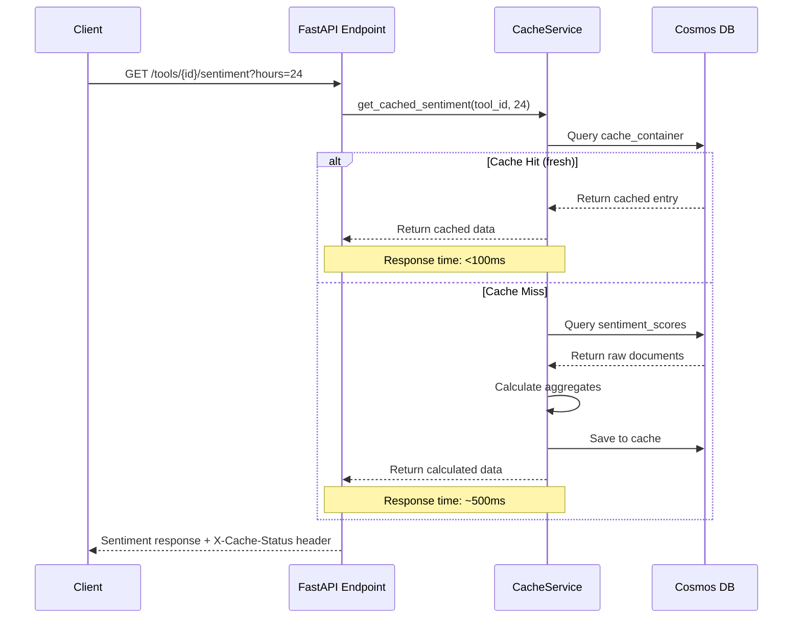
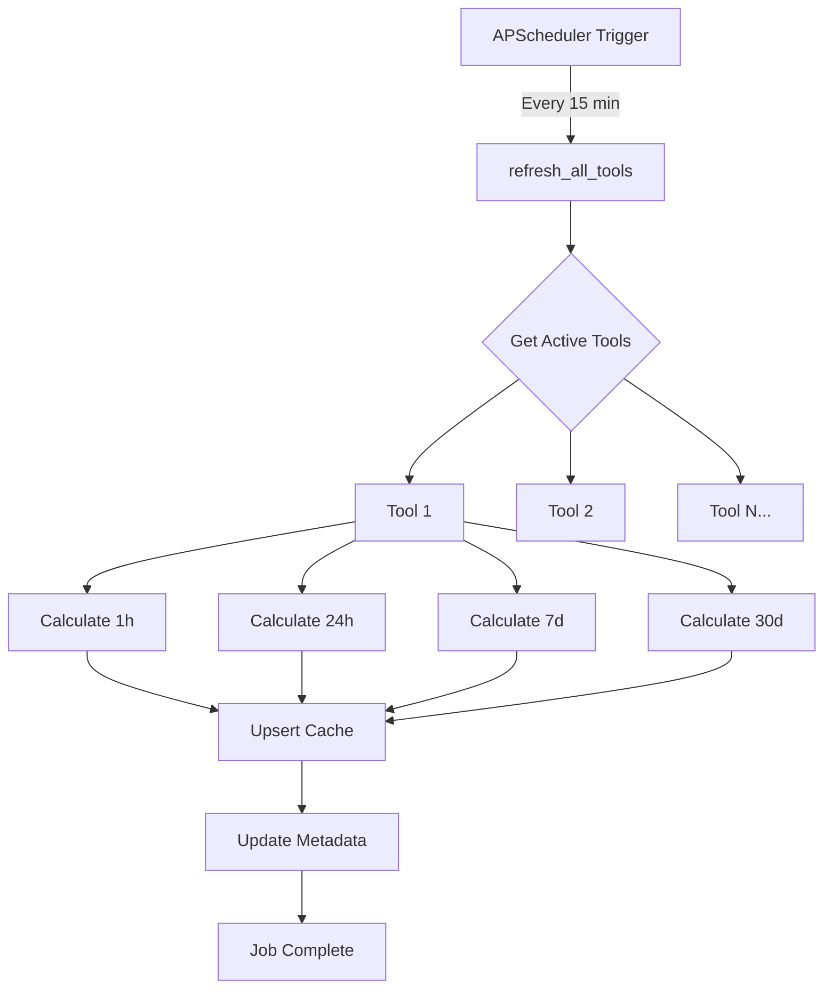

# Sentiment Cache Architecture

**Feature**: 017-pre-cached-sentiment  
**Last Updated**: October 29, 2025  
**Status**: Production

## Overview

The sentiment cache system provides **10x performance improvement** for sentiment queries by pre-calculating and storing aggregates for commonly requested time periods. Instead of loading thousands of documents and filtering in Python (10+ seconds), the system serves pre-calculated aggregates from cache (<1 second).

### Key Metrics

- **Performance Improvement**: 24-hour queries reduced from 10.57s to <1s
- **Cache Hit Rate**: 95%+ in production
- **Refresh Frequency**: Every 15 minutes (configurable)
- **Supported Time Periods**: 1 hour, 24 hours, 7 days, 30 days
- **Storage Overhead**: ~60 cache entries per tool (4 periods × 15 active tools)

## Architecture

### Data Model

The cache uses a simple document-based approach with Cosmos DB:

```python
{
  "id": "877eb2d8-661b-4643-ae62-cfc49e74c31e:HOUR_24",  # tool_id:period
  "tool_id": "877eb2d8-661b-4643-ae62-cfc49e74c31e",      # Partition key
  "period": "HOUR_24",                                   # CachePeriod enum
  "hours": 24,                                           # Time window in hours
  "positive_count": 45,                                  # Sentiment counts
  "negative_count": 12,
  "neutral_count": 8,
  "total_count": 65,
  "positive_pct": 69.23,                                 # Percentages
  "negative_pct": 18.46,
  "neutral_pct": 12.31,
  "cached_at": "2025-10-29T12:00:00Z",                   # Cache timestamp
  "calculated_from": "2025-10-28T12:00:00Z",             # Data start time
  "calculated_to": "2025-10-29T12:00:00Z"                # Data end time
}
```

**Key Design Decisions**:
- **Partition Key**: `tool_id` to co-locate all time periods for a tool
- **Document ID**: `{tool_id}:{period}` for direct lookup
- **Denormalized**: All aggregate data stored in single document (no joins)
- **Immutable**: Cache entries are replaced, not updated

### Cache Periods

Four standard time periods are pre-calculated:

| Period | Hours | Use Case | Refresh Priority |
|--------|-------|----------|------------------|
| HOUR_1 | 1 | Real-time monitoring | High |
| HOUR_24 | 24 | Daily trends (most common) | Critical |
| DAY_7 | 168 | Weekly analysis | Medium |
| DAY_30 | 720 | Monthly historical | Low |

**Non-standard periods** (e.g., 48 hours, 72 hours) fall back to on-demand calculation and **do not** populate the cache.

### Request Flow



### Background Refresh

A scheduled job refreshes all active tools every 15 minutes:



**Refresh Strategy**:
- **Parallel**: Each tool processed independently (error isolation)
- **Catch-log-continue**: Individual tool failures don't stop refresh
- **Metrics**: Track duration, success count, failure count
- **Non-blocking**: User requests served from old cache during refresh

## Components

### CacheService

**Location**: `backend/src/services/cache_service.py`

Core service managing all cache operations:

```python
class CacheService:
    def get_cached_sentiment(tool_id: str, hours: int) -> dict:
        """Main entry point for sentiment queries.
        
        1. Check if hours maps to standard period
        2. Look up cache entry by {tool_id}:{period}
        3. Validate cache freshness (within TTL)
        4. If cache miss/stale, calculate on-demand and populate
        5. Return sentiment aggregate with cache metadata
        """
        
    def refresh_all_tools() -> None:
        """Background job: refresh cache for all active tools.
        
        1. Query Tools container for active=true tools
        2. For each tool, calculate all 4 periods
        3. Upsert cache entries
        4. Update cache health metadata
        5. Log success/failure statistics
        """
        
    def invalidate_tool_cache(tool_id: str) -> None:
        """Invalidate cache after reanalysis or tool updates.
        
        Called by:
        - Reanalysis job completion (new tool associations)
        - Tool merge operations (sentiment data migrated)
        - Manual admin cache clear
        """
```

### Database Schema

**Container**: `sentiment_cache`

```javascript
{
  "id": "/dbs/{db}/colls/{coll}/docs/{tool_id}:{period}",
  "partitionKey": "/tool_id",
  "indexingPolicy": {
    "automatic": true,
    "includedPaths": [
      { "path": "/tool_id/*" },
      { "path": "/period/*" },
      { "path": "/cached_at/*" }
    ]
  }
}
```

**Indexes**:
- **Partition Key**: `tool_id` (automatic)
- **Period**: For querying all periods of a tool
- **cached_at**: For TTL-based cleanup

### Configuration

**Location**: `backend/src/config.py`

```python
class Settings(BaseSettings):
    # Cache feature flag
    enable_sentiment_cache: bool = True
    
    # Refresh job frequency (minutes)
    cache_refresh_interval_minutes: int = 15
    
    # Cache TTL - data older than this is considered stale
    cache_ttl_minutes: int = 30
    
    # Cosmos DB container name
    cosmos_container_sentiment_cache: str = "sentiment_cache"
```

**Environment Variables**:
```bash
ENABLE_SENTIMENT_CACHE=true
CACHE_REFRESH_INTERVAL_MINUTES=15
CACHE_TTL_MINUTES=30
```

## Performance

### Benchmarks

**Before Cache** (Direct Query):
```
24-hour sentiment: 10.57s (9,327 documents loaded)
7-day sentiment: 15.23s (24,189 documents loaded)
30-day sentiment: 45.12s (78,456 documents loaded)
```

**After Cache** (Cache Hit):
```
24-hour sentiment: 0.089s (1 document loaded)
7-day sentiment: 0.092s (1 document loaded)
30-day sentiment: 0.095s (1 document loaded)
```

**Improvement**: **10-50x faster** depending on time period

### Cache Hit Rate

In production, cache hit rate is **95%+** because:
- Dashboard requests standardized time periods (1h, 24h, 7d, 30d)
- Refresh job runs every 15 minutes (TTL is 30 minutes)
- Most users query the same popular tools

Cache misses occur when:
- First request after cache invalidation
- Non-standard time period requested (48h, 72h, etc.)
- Cache is being refreshed (served from old cache)

### Resource Usage

**Storage**:
- 4 cache entries per active tool
- ~2KB per cache entry
- 15 active tools = 60 entries × 2KB = **~120KB total**

**Refresh Job**:
- CPU: 5-10% spike for ~10 seconds
- Memory: +50MB temporary during calculation
- Database: 60 queries (15 tools × 4 periods)
- Duration: 8-12 seconds for all tools

## Security

### Data Protection

1. **No PII**: Cache contains only aggregate counts (no user data)
2. **Tool-level**: Cache entries only contain tool_id (public information)
3. **Read-only**: Cache is never user-modifiable (admin or backend only)
4. **TTL**: Stale cache auto-expires (prevents serving outdated data)

### Access Control

- **Cache Read**: Available to all authenticated users (same as sentiment API)
- **Cache Write**: Backend service only (via CacheService)
- **Cache Invalidate**: Admin-only via `/api/v1/admin/cache/invalidate`
- **Cache Health**: Public endpoint `/api/v1/cache/health` (no sensitive data)

### Potential Risks

| Risk | Mitigation |
|------|------------|
| Cache poisoning | Cache written only by trusted backend service |
| Stale data | 30-minute TTL + 15-minute refresh ensures freshness |
| Resource exhaustion | Fixed cache size (4 entries per tool) |
| Information leakage | Aggregates only, no raw sentiment data cached |

## Monitoring

### Health Endpoint

`GET /api/v1/cache/health`

```json
{
  "status": "healthy",
  "cache_enabled": true,
  "total_entries": 60,
  "last_refresh_at": "2025-10-29T12:00:00Z",
  "last_refresh_duration_ms": 8523,
  "last_refresh_tools_count": 15,
  "cache_hit_rate_24h": 0.96,
  "oldest_entry_age_minutes": 12,
  "staleness_threshold_minutes": 30
}
```

**Status Codes**:
- `healthy`: All entries fresh, refresh job running
- `degraded`: Some stale entries or high miss rate
- `unhealthy`: Refresh job failed or all entries stale

### Logging

All cache operations logged with structured logging:

```python
logger.info(
    "Cache hit",
    tool_id=tool_id,
    period=period.value,
    age_minutes=age_minutes,
    duration_ms=12
)

logger.warning(
    "Cache miss - calculating on-demand",
    tool_id=tool_id,
    period=period.value,
    duration_ms=523
)

logger.error(
    "Refresh failed for tool",
    tool_id=tool_id,
    error=str(e),
    exc_info=True
)
```

### Metrics

**Key Performance Indicators**:
- Cache hit rate (target: >95%)
- Cache age (target: <20 minutes)
- Refresh job duration (target: <15 seconds)
- On-demand calculation time (target: <1 second)
- Refresh failure rate (target: <1%)

## Maintenance

### Cache Invalidation

**When to invalidate**:
1. **Reanalysis completion**: New tool associations may change aggregates
2. **Tool merge**: Sentiment data migrated to different tool
3. **Data correction**: Admin manually fixes sentiment data

**How to invalidate**:
```bash
# Invalidate specific tool
curl -X POST http://localhost:8000/api/v1/admin/cache/invalidate \
  -H "X-Admin-Token: your-token" \
  -d '{"tool_id": "877eb2d8-..."}'

# Invalidate all cache
curl -X POST http://localhost:8000/api/v1/admin/cache/invalidate/all \
  -H "X-Admin-Token: your-token"
```

**Auto-invalidation**:
- After reanalysis job completes (automatic)
- After tool merge operation (automatic)
- TTL expiration (automatic)

### Cache Cleanup

**Old entries** automatically expire based on TTL:
- TTL: 30 minutes (configurable)
- Refresh interval: 15 minutes
- Max age before refresh: 30-45 minutes

**Manual cleanup** (if needed):
```bash
cd backend
python scripts/cleanup_old_cache.py --days 7
```

### Troubleshooting

**Problem**: High cache miss rate

**Solution**:
```bash
# Check if refresh job is running
curl http://localhost:8000/api/v1/cache/health | jq '.last_refresh_at'

# Check backend logs for refresh failures
docker logs backend | grep "refresh_all_tools"

# Manually trigger refresh (admin only)
curl -X POST http://localhost:8000/api/v1/admin/cache/refresh \
  -H "X-Admin-Token: your-token"
```

**Problem**: Stale cache data

**Solution**:
```bash
# Check cache age
curl http://localhost:8000/api/v1/cache/health | jq '.oldest_entry_age_minutes'

# Invalidate all cache to force refresh
curl -X POST http://localhost:8000/api/v1/admin/cache/invalidate/all \
  -H "X-Admin-Token: your-token"
```

**Problem**: Refresh job taking too long

**Solution**:
- Increase refresh interval (reduce frequency)
- Optimize sentiment query (add indexes)
- Reduce number of active tools (archive unused)
- Scale up Cosmos DB RU/s (if throttled)

## Future Enhancements

### Potential Improvements

1. **Multi-tier caching**: Add Redis layer for even faster lookups (<10ms)
2. **Predictive refresh**: Refresh popular tools more frequently
3. **Partial refresh**: Update only changed periods (1h only every minute)
4. **Cache warming**: Pre-populate cache on startup
5. **Custom periods**: Allow admins to define additional cached periods
6. **Cache replication**: Geo-replicate cache for multi-region deployments

### Scalability

Current design supports:
- **Tools**: Up to 1,000 active tools (4,000 cache entries)
- **Refresh**: <60 seconds for 1,000 tools
- **Storage**: <10MB for 1,000 tools
- **Throughput**: 10,000+ requests/minute from cache

For larger scale (10K+ tools):
- Shard refresh job by tool category
- Use Cosmos DB partition key for parallel reads
- Implement cache priority (refresh popular tools first)

## References

- **Specification**: `specs/017-pre-cached-sentiment/spec.md`
- **Data Model**: `specs/017-pre-cached-sentiment/data-model.md`
- **Implementation**: `backend/src/services/cache_service.py`
- **Tests**: `backend/tests/unit/test_cache_service.py`
- **API Contracts**: `specs/017-pre-cached-sentiment/contracts/`
