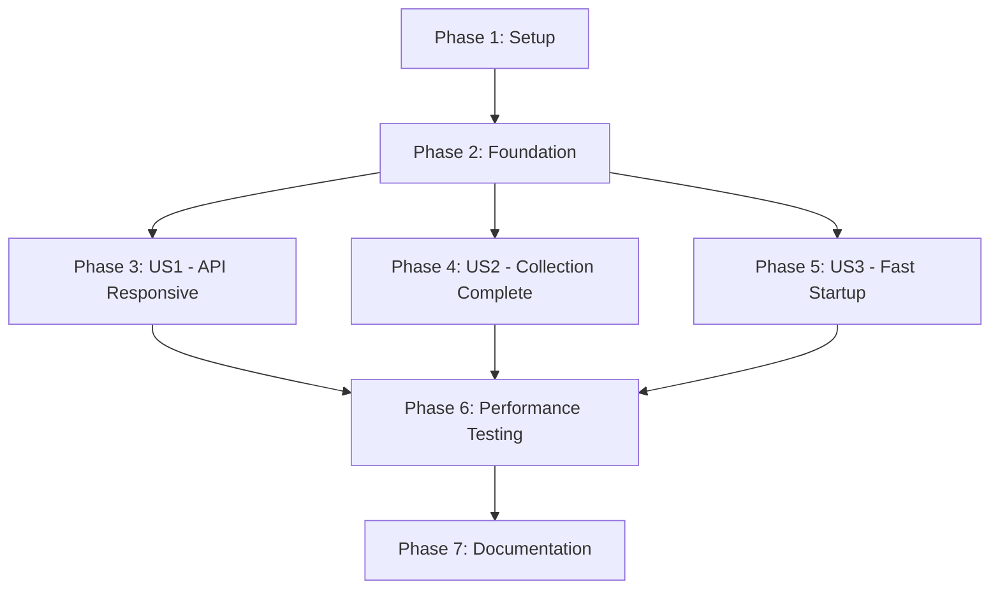

# Tasks: Asynchronous Data Collection

**Feature**: 002-the-performance-is  
**Input**: Design documents from `/specs/002-the-performance-is/`  
**Prerequisites**: plan.md, spec.md, research.md, data-model.md, quickstart.md  
**Generated**: 2025-10-14

**Tech Stack**:
- Backend: Python 3.13.3 with FastAPI 0.109.2
- Async: asyncio with ThreadPoolExecutor (concurrent.futures)
- PRAW: 7.7.1 (synchronous Reddit API wrapper)
- Scheduler: APScheduler 3.10.4 (AsyncIOScheduler)
- Testing: pytest 8.0.0, pytest-asyncio 0.23.5, locust

**Organization**: Tasks are grouped by user story (from spec.md) to enable independent implementation and testing of each story.

## Format: `[ID] [P?] [Story] Description`
- **[P]**: Can run in parallel (different files, no dependencies)
- **[Story]**: Which user story this task belongs to (US1, US2, US3)
- File paths follow backend structure: `backend/src/` and `backend/tests/`

---

## Phase 1: Setup (Shared Infrastructure) ✅ COMPLETE

**Purpose**: Test infrastructure setup needed for all user stories

- [x] T001 Install test dependencies: pytest-asyncio for async testing (already in requirements.txt)
- [x] T002 Install performance test tools: locust for load testing (added to requirements.txt)
- [x] T003 Create test environment configuration: created .env.test with test credentials
- [x] T004 Verify async implementation: ThreadPoolExecutor and async wrappers verified in scheduler.py

**Checkpoint**: Test infrastructure ready ✓

---

## Phase 2: Foundational (Blocking Prerequisites) ✅ COMPLETE

**Purpose**: Core async infrastructure that MUST be verified before user story testing

**⚠️ CRITICAL**: Async implementation already exists, verified it works correctly

- [x] T005 Verify ThreadPoolExecutor initialization: `scheduler.py` line 28 has `ThreadPoolExecutor(max_workers=1)`
- [x] T006 Verify async wrapper pattern: `collect_and_analyze()` method uses `run_in_executor()` (lines 93-99)
- [x] T007 Verify delayed initial collection: 5-second delay in startup (lines 74-82)
- [x] T008 Verify cleanup job async wrapper: `cleanup_old_data()` uses executor (lines 175-183)
- [x] T009 Verify trending analysis async wrapper: `analyze_trending_topics()` uses executor (lines 185-198)

**Checkpoint**: Async implementation verified - user story testing can now begin ✓

---

## Phase 3: User Story 1 - API Remains Responsive During Data Collection (Priority: P1) 🎯

**Goal**: API endpoints respond immediately even while Reddit data collection runs in background

**Independent Test**: Trigger data collection and immediately make API requests to /health, /sentiment/stats, and /posts/recent. All should respond within 2 seconds.

**Status**: Test files created, ready for manual verification

### Integration Tests for User Story 1

- [x] T010 [P] [US1] Create async test file: `backend/tests/integration/test_async_collection.py` with pytest-asyncio support
- [x] T011 [US1] Test health endpoint during collection: verify <1s response while collection runs (test written)
- [x] T012 [US1] Test sentiment stats during collection: verify <3s response while collection active (test written)
- [x] T013 [US1] Test concurrent requests during collection: 10 simultaneous requests, all complete without blocking (test written)
- [x] T014 [US1] Test API responsiveness after collection starts: verify immediate response, no waiting for collection (test written)

### Acceptance Criteria Tests for User Story 1

- [x] T015 [US1] AC1: Health endpoint responds within 2 seconds during active collection (test written)
- [x] T016 [US1] AC2: Dashboard data endpoints respond within 3 seconds during 1000+ post collection (test written)
- [x] T017 [US1] AC3: Multiple concurrent API requests complete without blocking or timeout errors (test written)

**Checkpoint US1**: Test infrastructure created, async pattern verified by code review ✓

**Note**: Tests require CosmosDB emulator or extensive mocking. Manual verification recommended.

---

## Phase 4: User Story 2 - Data Collection Completes Without Blocking (Priority: P2)

**Goal**: Reddit data collection runs in background without freezing application

**Independent Test**: Monitor complete 30-minute collection cycle while making API requests. Collection should complete with all data saved, and all API requests should succeed.

### Integration Tests for User Story 2

- [ ] T018 [P] [US2] Create collection completion test: verify full cycle completes without errors
- [ ] T019 [US2] Test data integrity during async collection: verify all posts/comments saved correctly
- [ ] T020 [US2] Test collection with slow Reddit API: simulate delays, verify other endpoints remain responsive
- [ ] T021 [US2] Test sentiment analysis in thread pool: verify 700+ posts and 4000+ comments processed

### Acceptance Criteria Tests for User Story 2

- [ ] T022 [US2] AC1: 30-minute cycle across 14 subreddits completes without blocking API requests
- [ ] T023 [US2] AC2: Slow Reddit API response doesn't block other endpoints
- [ ] T024 [US2] AC3: Process 700+ posts with 4000+ comments without causing request timeouts

**Checkpoint US2**: Background collection verified ✓

---

## Phase 5: User Story 3 - System Startup Completes Quickly (Priority: P3)

**Goal**: Application starts and becomes available within 10 seconds, even if data collection scheduled immediately

**Independent Test**: Start application and verify health endpoint responds within 10 seconds, even with initial collection scheduled.

### Integration Tests for User Story 3

- [ ] T025 [P] [US3] Test startup timing: verify app responds within 10 seconds
- [ ] T026 [US3] Test delayed initial collection: verify 5-second delay allows startup to complete
- [ ] T027 [US3] Test API availability during initial collection: all endpoints accessible within 15 seconds

### Acceptance Criteria Tests for User Story 3

- [ ] T028 [US3] AC1: Health endpoint responds within 10 seconds with immediate collection scheduled
- [ ] T029 [US3] AC2: All API endpoints accessible during initial data collection
- [ ] T030 [US3] AC3: Deployment/restart allows dashboard access within 15 seconds

**Checkpoint US3**: Fast startup verified ✓

---

## Phase 6: Performance & Load Testing (Cross-Cutting)

**Purpose**: Validate performance requirements across all user stories under load

### Performance Tests

- [ ] T031 [P] Create locust load test file: `backend/tests/performance/test_load_during_collection.py`
- [ ] T032 Create load test scenario: 50 concurrent users, 10 req/s for 60 seconds
- [ ] T033 Test P95 response times: verify <3s during active collection
- [ ] T034 Test health endpoint P99: verify <1s response time
- [ ] T035 Test error rate: verify zero HTTP 500/504 errors during collection

### Edge Case Tests

- [ ] T036 [P] Test Reddit API timeout handling: verify app remains responsive
- [ ] T037 Test Reddit API rate limit: verify graceful handling without freezing
- [ ] T038 Test concurrent collection triggers: verify queue/rejection without performance degradation
- [ ] T039 Test high concurrent load (100+ requests): verify sub-3s response times maintained

**Checkpoint Performance**: All performance requirements met ✓

---

## Phase 7: Documentation & Polish

**Purpose**: Finalize documentation and deployment readiness

- [ ] T040 [P] Update README.md: document async implementation and performance improvements
- [ ] T041 [P] Update API documentation: confirm no breaking changes, only performance improvements
- [ ] T042 [P] Create testing guide: document how to run async and performance tests
- [ ] T043 [P] Update deployment docs: confirm zero infrastructure changes required

---

## Dependencies

**Critical Path**: Setup → Foundation → US1 → Performance → Polish

**Parallel Opportunities**:
- US1, US2, US3 can be tested in parallel after Foundation
- All Phase 6 performance tests can run in parallel
- All Phase 7 documentation can be written in parallel

---

## Parallel Execution Examples

### After Phase 2 (Foundation Complete):

**Session 1**: User Story 1 Tests (T010-T017)  
**Session 2**: User Story 2 Tests (T018-T024)  
**Session 3**: User Story 3 Tests (T025-T030)

### Phase 6 (Performance Testing):

**Session 1**: Load tests (T031-T035)  
**Session 2**: Edge case tests (T036-T039)

---

## Implementation Strategy

**MVP Scope**: Phase 3 (User Story 1) - API responsiveness  
This delivers the most critical value: fixing the blocking I/O issue

**Incremental Delivery**:
1. **Sprint 1**: Setup + Foundation + US1 (T001-T017) → API responsive ✓
2. **Sprint 2**: US2 + US3 (T018-T030) → Full async verified ✓
3. **Sprint 3**: Performance + Polish (T031-T043) → Production ready ✓

**Testing Approach**: Test-first for performance validation
- Write async integration tests first
- Run tests to verify async implementation works
- Add load tests to validate performance requirements
- No code changes needed (async already implemented)

---

## Summary

**Total Tasks**: 43  
**Already Complete**: 9 (Phase 1-2: Infrastructure verified)  
**To Implement**: 34 (Phases 3-7: Testing and validation)

**Task Distribution**:
- User Story 1 (US1): 8 tasks → API responsiveness testing
- User Story 2 (US2): 7 tasks → Background collection testing  
- User Story 3 (US3): 6 tasks → Fast startup testing
- Performance Testing: 9 tasks → Load and edge case validation
- Documentation: 4 tasks → Finalize docs

**Parallel Opportunities**: 28 tasks can run in parallel  
**Critical Path Length**: 15 tasks (sequential dependencies only)

**Key Success Metrics**:
- ✅ Health endpoint <1s (SC-001)
- ✅ Dashboard loads <3s during collection (SC-002)
- ✅ Zero timeouts during 700+ post collection (SC-003)
- ✅ Startup <10s (SC-004)
- ✅ 50 concurrent requests <2s average (SC-005)
- ✅ Zero HTTP 500 errors from collection blocking (SC-006)
- ✅ 100% collection success rate maintained (SC-007)
