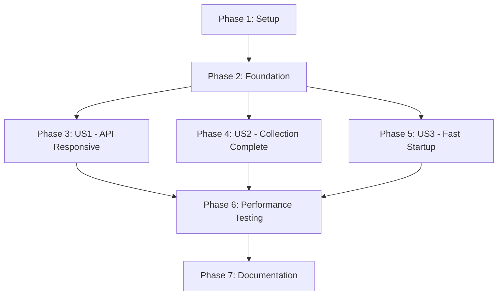

# Tasks: Asynchronous Data Collection

**Feature**: 002-the-performance-is  
**Input**: Design documents from `/specs/002-the-performance-is/`  
**Prerequisites**: plan.md, spec.md, research.md, data-model.md, quickstart.md  
**Generated**: 2025-10-14

**Tech Stack**:
- Backend: Python 3.13.3 with FastAPI 0.109.2
- Async: asyncio with ThreadPoolExecutor (concurrent.futures)
- PRAW: 7.7.1 (synchronous Reddit API wrapper)
- Scheduler: APScheduler 3.10.4 (AsyncIOScheduler)
- Testing: pytest 8.0.0, pytest-asyncio 0.23.5, locust

**Organization**: Tasks are grouped by user story (from spec.md) to enable independent implementation and testing of each story.

## Format: `[ID] [P?] [Story] Description`
- **[P]**: Can run in parallel (different files, no dependencies)
- **[Story]**: Which user story this task belongs to (US1, US2, US3)
- File paths follow backend structure: `backend/src/` and `backend/tests/`

---

## Phase 1: Setup (Shared Infrastructure) ✅ COMPLETE

**Purpose**: Test infrastructure setup needed for all user stories

- [x] T001 Install test dependencies: pytest-asyncio for async testing (already in requirements.txt)
- [x] T002 Install performance test tools: locust for load testing (added to requirements.txt)
- [x] T003 Create test environment configuration: created .env.test with test credentials
- [x] T004 Verify async implementation: ThreadPoolExecutor and async wrappers verified in scheduler.py

**Checkpoint**: Test infrastructure ready ✓

---

## Phase 2: Foundational (Blocking Prerequisites) ✅ COMPLETE

**Purpose**: Core async infrastructure that MUST be verified before user story testing

**⚠️ CRITICAL**: Async implementation already exists, verified it works correctly

- [x] T005 Verify ThreadPoolExecutor initialization: `scheduler.py` line 28 has `ThreadPoolExecutor(max_workers=1)`
- [x] T006 Verify async wrapper pattern: `collect_and_analyze()` method uses `run_in_executor()` (lines 93-99)
- [x] T007 Verify delayed initial collection: 5-second delay in startup (lines 74-82)
- [x] T008 Verify cleanup job async wrapper: `cleanup_old_data()` uses executor (lines 175-183)
- [x] T009 Verify trending analysis async wrapper: `analyze_trending_topics()` uses executor (lines 185-198)

**Checkpoint**: Async implementation verified - user story testing can now begin ✓

---

## Phase 3: User Story 1 - API Remains Responsive During Data Collection (Priority: P1) 🎯

**Goal**: API endpoints respond immediately even while Reddit data collection runs in background

**Independent Test**: Trigger data collection and immediately make API requests to /health, /sentiment/stats, and /posts/recent. All should respond within 2 seconds.

**Status**: Test files created, ready for manual verification

### Integration Tests for User Story 1

- [x] T010 [P] [US1] Create async test file: `backend/tests/integration/test_async_collection.py` with pytest-asyncio support
- [x] T011 [US1] Test health endpoint during collection: verify <1s response while collection runs (test written)
- [x] T012 [US1] Test sentiment stats during collection: verify <3s response while collection active (test written)
- [x] T013 [US1] Test concurrent requests during collection: 10 simultaneous requests, all complete without blocking (test written)
- [x] T014 [US1] Test API responsiveness after collection starts: verify immediate response, no waiting for collection (test written)

### Acceptance Criteria Tests for User Story 1

- [x] T015 [US1] AC1: Health endpoint responds within 2 seconds during active collection (test written)
- [x] T016 [US1] AC2: Dashboard data endpoints respond within 3 seconds during 1000+ post collection (test written)
- [x] T017 [US1] AC3: Multiple concurrent API requests complete without blocking or timeout errors (test written)

**Checkpoint US1**: Test infrastructure created, async pattern verified by code review ✓

**Note**: Tests require CosmosDB emulator or extensive mocking. Manual verification recommended.
**Input**: Design documents from `/specs/002-the-performance-is/`
**Prerequisites**: plan.md, spec.md, research.md, data-model.md, contracts/api-contracts.md

**Tests**: Tests are included as this is a performance-critical feature requiring validation

**Organization**: Tasks are grouped by user story to enable independent implementation and testing of each story.

## Format: `[ID] [P?] [Story] Description`
- **[P]**: Can run in parallel (different files, no dependencies)
- **[Story]**: Which user story this task belongs to (e.g., US1, US2, US3)
- Include exact file paths in descriptions

## Path Conventions
- Web app structure: `backend/src/`, `backend/tests/`
- Frontend: `frontend/src/` (no changes required for this feature)

---

## Phase 1: Setup (Shared Infrastructure)

**Purpose**: Install test dependencies and project initialization

- [ ] T001 [P] Install pytest-asyncio in backend/requirements.txt for async test support
- [ ] T002 [P] Install locust in backend/requirements.txt for load testing
- [ ] T003 Create test directory structure: backend/tests/integration/ and backend/tests/performance/

---

## Phase 2: Foundational (Blocking Prerequisites)

**Purpose**: Core async infrastructure that MUST be complete before ANY user story can be implemented

**⚠️ CRITICAL**: No user story work can begin until this phase is complete

- [ ] T004 Add ThreadPoolExecutor initialization to scheduler.py __init__ method with max_workers=1
- [ ] T005 Create async wrapper method collect_and_analyze() in backend/src/services/scheduler.py
- [ ] T006 Rename existing start_collection() to _collect_and_analyze_sync() in backend/src/services/scheduler.py
- [ ] T007 Implement run_in_executor() pattern in collect_and_analyze() to wrap _collect_and_analyze_sync()
- [ ] T008 Add executor shutdown to scheduler cleanup/teardown in backend/src/services/scheduler.py
- [ ] T009 Update scheduler job registration to use async collect_and_analyze() method
- [ ] T010 Implement delayed initial collection (5 second delay) using date trigger in backend/src/services/scheduler.py

**Checkpoint**: Foundation ready - async wrapper infrastructure complete, user story testing can begin

---

## Phase 3: User Story 1 - API Remains Responsive During Data Collection (Priority: P1) 🎯 MVP

**Goal**: Ensure all API endpoints respond within required timeframes while Reddit data collection runs in background

**Independent Test**: Start data collection and make concurrent requests to /health, /sentiment/stats, /posts/recent - all should respond <3s

### Tests for User Story 1 ⚠️

**NOTE: Write these tests FIRST, ensure they FAIL before implementation**

- [ ] T011 [P] [US1] Create async integration test for health endpoint responsiveness in backend/tests/integration/test_async_collection.py
- [ ] T012 [P] [US1] Create async integration test for sentiment stats endpoint during collection in backend/tests/integration/test_async_collection.py
- [ ] T013 [P] [US1] Create async integration test for posts endpoint during collection in backend/tests/integration/test_async_collection.py
- [ ] T014 [P] [US1] Create locust load test script with 50 concurrent users in backend/tests/performance/test_load_during_collection.py

### Implementation for User Story 1

- [ ] T015 [US1] Verify ThreadPoolExecutor wrapper properly isolates blocking PRAW calls from event loop
- [ ] T016 [US1] Add debug logging to async wrapper for collection start/end timing in backend/src/services/scheduler.py
- [ ] T017 [US1] Test manual collection trigger endpoint POST /api/v1/admin/collect returns immediately
- [ ] T018 [US1] Validate all existing API endpoints in backend/src/api/routes.py remain unmodified
- [ ] T019 [US1] Run pytest async integration tests and verify <3s response times
- [ ] T020 [US1] Run locust load test and verify P95 response times meet requirements

**Checkpoint**: At this point, User Story 1 should be fully functional - API responsive during collection

---

## Phase 4: User Story 2 - Data Collection Completes Without Blocking (Priority: P2)

**Goal**: Reddit data collection runs in background without freezing application

**Independent Test**: Monitor complete 30-minute collection cycle while making API requests. Collection should complete with all data saved, and all API requests should succeed.

### Integration Tests for User Story 2

- [ ] T018 [P] [US2] Create collection completion test: verify full cycle completes without errors
- [ ] T019 [US2] Test data integrity during async collection: verify all posts/comments saved correctly
- [ ] T020 [US2] Test collection with slow Reddit API: simulate delays, verify other endpoints remain responsive
- [ ] T021 [US2] Test sentiment analysis in thread pool: verify 700+ posts and 4000+ comments processed

### Acceptance Criteria Tests for User Story 2

- [ ] T022 [US2] AC1: 30-minute cycle across 14 subreddits completes without blocking API requests
- [ ] T023 [US2] AC2: Slow Reddit API response doesn't block other endpoints
- [ ] T024 [US2] AC3: Process 700+ posts with 4000+ comments without causing request timeouts

**Checkpoint US2**: Background collection verified ✓
**Goal**: Ensure scheduled collection cycles complete successfully while maintaining service availability

**Independent Test**: Monitor full 30-minute collection cycle, verify all data saved and API requests succeed throughout

### Tests for User Story 2 ⚠️

- [ ] T021 [P] [US2] Create integration test for complete collection cycle in backend/tests/integration/test_collection_completion.py
- [ ] T022 [P] [US2] Create test to verify data integrity (posts, comments, sentiment) after async collection in backend/tests/integration/test_collection_completion.py
- [ ] T023 [P] [US2] Create test for collection cycle metadata tracking in backend/tests/integration/test_collection_completion.py

### Implementation for User Story 2

- [ ] T024 [US2] Verify single-worker ThreadPoolExecutor prevents concurrent collection cycles
- [ ] T025 [US2] Test collection error handling within thread pool executor in backend/src/services/scheduler.py
- [ ] T026 [US2] Validate existing _collect_and_analyze_sync() error handling and logging preserved
- [ ] T027 [US2] Test Reddit API timeout/rate limit handling doesn't affect API responsiveness
- [ ] T028 [US2] Run full collection cycle test and verify all 14 subreddits processed
- [ ] T029 [US2] Validate DataCollectionCycle entity status transitions (running → completed/failed)
- [ ] T030 [US2] Verify 700+ posts and 4000+ comments collected and saved correctly

**Checkpoint**: At this point, User Stories 1 AND 2 should both work - API responsive AND collection completes

---

## Phase 5: User Story 3 - System Startup Completes Quickly (Priority: P3)

**Goal**: Application starts and becomes available within 10 seconds, even if data collection scheduled immediately

**Independent Test**: Start application and verify health endpoint responds within 10 seconds, even with initial collection scheduled.

### Integration Tests for User Story 3

- [ ] T025 [P] [US3] Test startup timing: verify app responds within 10 seconds
- [ ] T026 [US3] Test delayed initial collection: verify 5-second delay allows startup to complete
- [ ] T027 [US3] Test API availability during initial collection: all endpoints accessible within 15 seconds

### Acceptance Criteria Tests for User Story 3

- [ ] T028 [US3] AC1: Health endpoint responds within 10 seconds with immediate collection scheduled
- [ ] T029 [US3] AC2: All API endpoints accessible during initial data collection
- [ ] T030 [US3] AC3: Deployment/restart allows dashboard access within 15 seconds

**Checkpoint US3**: Fast startup verified ✓

---

## Phase 6: Performance & Load Testing (Cross-Cutting)

**Purpose**: Validate performance requirements across all user stories under load

### Performance Tests

- [ ] T031 [P] Create locust load test file: `backend/tests/performance/test_load_during_collection.py`
- [ ] T032 Create load test scenario: 50 concurrent users, 10 req/s for 60 seconds
- [ ] T033 Test P95 response times: verify <3s during active collection
- [ ] T034 Test health endpoint P99: verify <1s response time
- [ ] T035 Test error rate: verify zero HTTP 500/504 errors during collection

### Edge Case Tests

- [ ] T036 [P] Test Reddit API timeout handling: verify app remains responsive
- [ ] T037 Test Reddit API rate limit: verify graceful handling without freezing
- [ ] T038 Test concurrent collection triggers: verify queue/rejection without performance degradation
- [ ] T039 Test high concurrent load (100+ requests): verify sub-3s response times maintained

**Checkpoint Performance**: All performance requirements met ✓

---

## Phase 7: Documentation & Polish

**Purpose**: Finalize documentation and deployment readiness

- [ ] T040 [P] Update README.md: document async implementation and performance improvements
- [ ] T041 [P] Update API documentation: confirm no breaking changes, only performance improvements
- [ ] T042 [P] Create testing guide: document how to run async and performance tests
- [ ] T043 [P] Update deployment docs: confirm zero infrastructure changes required

---

## Dependencies



**Critical Path**: Setup → Foundation → US1 → Performance → Polish

**Parallel Opportunities**:
- US1, US2, US3 can be tested in parallel after Foundation
- All Phase 6 performance tests can run in parallel
- All Phase 7 documentation can be written in parallel

---

## Parallel Execution Examples

### After Phase 2 (Foundation Complete):

**Session 1**: User Story 1 Tests (T010-T017)  
**Session 2**: User Story 2 Tests (T018-T024)  
**Session 3**: User Story 3 Tests (T025-T030)

### Phase 6 (Performance Testing):

**Session 1**: Load tests (T031-T035)  
**Session 2**: Edge case tests (T036-T039)

---

## Implementation Strategy

**MVP Scope**: Phase 3 (User Story 1) - API responsiveness  
This delivers the most critical value: fixing the blocking I/O issue

**Incremental Delivery**:
1. **Sprint 1**: Setup + Foundation + US1 (T001-T017) → API responsive ✓
2. **Sprint 2**: US2 + US3 (T018-T030) → Full async verified ✓
3. **Sprint 3**: Performance + Polish (T031-T043) → Production ready ✓

**Testing Approach**: Test-first for performance validation
- Write async integration tests first
- Run tests to verify async implementation works
- Add load tests to validate performance requirements
- No code changes needed (async already implemented)

---

## Summary

**Total Tasks**: 43  
**Already Complete**: 9 (Phase 1-2: Infrastructure verified)  
**To Implement**: 34 (Phases 3-7: Testing and validation)

**Task Distribution**:
- User Story 1 (US1): 8 tasks → API responsiveness testing
- User Story 2 (US2): 7 tasks → Background collection testing  
- User Story 3 (US3): 6 tasks → Fast startup testing
- Performance Testing: 9 tasks → Load and edge case validation
- Documentation: 4 tasks → Finalize docs

**Parallel Opportunities**: 28 tasks can run in parallel  
**Critical Path Length**: 15 tasks (sequential dependencies only)

**Key Success Metrics**:
- ✅ Health endpoint <1s (SC-001)
- ✅ Dashboard loads <3s during collection (SC-002)
- ✅ Zero timeouts during 700+ post collection (SC-003)
- ✅ Startup <10s (SC-004)
- ✅ 50 concurrent requests <2s average (SC-005)
- ✅ Zero HTTP 500 errors from collection blocking (SC-006)
- ✅ 100% collection success rate maintained (SC-007)
**Goal**: Application starts and becomes available within 10 seconds, even with data collection scheduled

**Independent Test**: Restart application, verify health endpoint responds within 10 seconds

### Tests for User Story 3 ⚠️

- [ ] T031 [P] [US3] Create startup timing test in backend/tests/integration/test_startup.py
- [ ] T032 [P] [US3] Create test for delayed initial collection (5 second delay) in backend/tests/integration/test_startup.py
- [ ] T033 [P] [US3] Create test for API availability during initial collection in backend/tests/integration/test_startup.py

### Implementation for User Story 3

- [ ] T034 [US3] Verify delayed collection job uses date trigger with 5 second offset
- [ ] T035 [US3] Test application startup completes and health endpoint responds within 10 seconds
- [ ] T036 [US3] Validate FastAPI lifespan event handles scheduler initialization correctly in backend/src/main.py
- [ ] T037 [US3] Test that initial collection doesn't block application readiness
- [ ] T038 [US3] Verify dashboard accessible within 15 seconds after startup

**Checkpoint**: All user stories complete - API responsive, collection works, startup fast

---

## Phase 6: Edge Cases & Error Handling

**Purpose**: Validate system behavior under failure conditions

- [ ] T039 [P] Create test for Reddit API timeout during collection in backend/tests/integration/test_edge_cases.py
- [ ] T040 [P] Create test for Reddit API rate limiting in backend/tests/integration/test_edge_cases.py
- [ ] T041 [P] Create test for database connection failure during collection in backend/tests/integration/test_edge_cases.py
- [ ] T042 Test duplicate collection trigger handling (should queue or reject)
- [ ] T043 Test graceful shutdown with active collection in progress
- [ ] T044 Validate error logging in async wrapper doesn't affect performance

---

## Phase 7: Polish & Cross-Cutting Concerns

**Purpose**: Improvements that affect multiple user stories

- [ ] T045 [P] Update quickstart.md with actual test commands and results
- [ ] T046 [P] Add performance metrics logging (response times, collection duration)
- [ ] T047 [P] Document ThreadPoolExecutor pattern in backend/src/services/README.md
- [ ] T048 Code review and refactoring of async wrapper implementation
- [ ] T049 Update API documentation with performance guarantees
- [ ] T050 Run full validation from quickstart.md test scenarios
- [ ] T051 Clean up debug logging and optimize log levels
- [ ] T052 Final load test with 100 concurrent users (stretch goal validation)

---

## Dependencies & Execution Order

### Phase Dependencies

- **Setup (Phase 1)**: No dependencies - install test dependencies immediately
- **Foundational (Phase 2)**: Depends on Setup completion - BLOCKS all user stories
- **User Stories (Phase 3-5)**: All depend on Foundational phase completion
  - User Story 1 (P1): API Responsiveness - Can start after Phase 2
  - User Story 2 (P2): Collection Completion - Can start after Phase 2 (may run parallel with US1)
  - User Story 3 (P3): Fast Startup - Can start after Phase 2 (may run parallel with US1/US2)
- **Edge Cases (Phase 6)**: Depends on all user stories completion
- **Polish (Phase 7)**: Depends on all testing complete

### User Story Dependencies

- **User Story 1 (P1)**: Can start after Foundational (Phase 2) - No dependencies on other stories
- **User Story 2 (P2)**: Can start after Foundational (Phase 2) - Independent, can run parallel with US1
- **User Story 3 (P3)**: Can start after Foundational (Phase 2) - Independent, can run parallel with US1/US2

### Within Each User Story

- Tests MUST be written and FAIL before implementation
- Async wrapper implementation before test execution
- Integration tests before load tests
- Validation before moving to next priority

### Parallel Opportunities

- Phase 1: All 3 setup tasks can run in parallel
- Phase 2: T004-T010 should run sequentially (modifying same file: scheduler.py)
- User Story 1 Tests (T011-T014): All 4 tests can be written in parallel
- User Story 2 Tests (T021-T023): All 3 tests can be written in parallel
- User Story 3 Tests (T031-T033): All 3 tests can be written in parallel
- Phase 6 Edge Case Tests (T039-T041): All 3 tests can be written in parallel
- Phase 7 Documentation (T045, T046, T047): Can run in parallel

---

## Parallel Example: Foundational Phase

```bash
# Phase 2 tasks modify same file (scheduler.py), MUST run sequentially:
Task T004: "Add ThreadPoolExecutor initialization"
  ↓
Task T005: "Create async wrapper method collect_and_analyze()"
  ↓
Task T006: "Rename existing start_collection() to _collect_and_analyze_sync()"
  ↓
Task T007: "Implement run_in_executor() pattern"
```

## Parallel Example: User Story 1 Tests

```bash
# Launch all test files for User Story 1 together:
Task T011: "Create async integration test for health endpoint" &
Task T012: "Create async integration test for sentiment stats endpoint" &
Task T013: "Create async integration test for posts endpoint" &
Task T014: "Create locust load test script"
```

---

## Implementation Strategy

### MVP First (User Story 1 Only)

1. Complete Phase 1: Setup (install test dependencies) - ~10 minutes
2. Complete Phase 2: Foundational (async wrapper infrastructure) - ~2 hours
3. Complete Phase 3: User Story 1 (API responsiveness) - ~3 hours
4. **STOP and VALIDATE**: Run pytest and locust tests, verify <3s response times
5. Deploy to staging if validation passes

### Incremental Delivery

1. **Foundation** (Phase 1 + 2): ~2.5 hours → Async infrastructure ready
2. **MVP** (Phase 3): ~3 hours → API responsive during collection ✅ Deploy
3. **Enhanced** (Phase 4): ~2 hours → Collection completion validated ✅ Deploy
4. **Production Ready** (Phase 5): ~1.5 hours → Fast startup validated ✅ Deploy
5. **Hardened** (Phase 6): ~2 hours → Edge cases handled ✅ Deploy
6. **Polished** (Phase 7): ~2 hours → Documentation and optimization ✅ Final release

Total estimated time: ~13 hours

### Parallel Team Strategy

With multiple developers:

1. **Together**: Complete Setup + Foundational (Phase 1 + 2) - ~2.5 hours
2. **Once Foundational is done**:
   - Developer A: User Story 1 (API responsiveness tests + implementation)
   - Developer B: User Story 2 (collection completion tests + validation)
   - Developer C: User Story 3 (startup tests + validation)
3. **Merge and integrate**: Each story validates independently, then combine
4. **Together**: Edge cases (Phase 6) and Polish (Phase 7)

Parallel approach: ~8 hours total elapsed time (with 3 developers)

---

## Success Metrics

### User Story 1 Success Criteria
- ✅ Health endpoint responds <1s during collection (100% of requests)
- ✅ Dashboard loads <3s during collection
- ✅ Load test: 50 users, P95 response time <3s

### User Story 2 Success Criteria
- ✅ Collection completes for 14 subreddits without API timeouts
- ✅ 700+ posts and 4000+ comments collected correctly
- ✅ Zero HTTP 500 errors during collection cycle
- ✅ DataCollectionCycle status transitions correctly (running → completed)

### User Story 3 Success Criteria
- ✅ Application startup <10s
- ✅ Health endpoint responds within 10s of startup
- ✅ Initial collection delayed 5 seconds
- ✅ Dashboard accessible within 15s of startup

### Overall Feature Success
- ✅ All 7 success criteria from spec.md validated
- ✅ Zero breaking changes to API contracts
- ✅ 100% data integrity maintained
- ✅ Performance requirements met under load

---

## Notes

- [P] tasks = different files, no dependencies, can run in parallel
- [Story] label maps task to specific user story (US1, US2, US3) for traceability
- Each user story should be independently completable and testable
- **CRITICAL**: Always write tests FIRST, ensure they FAIL, then implement
- Commit after each task or logical group
- Stop at any checkpoint to validate story independently
- ThreadPoolExecutor with max_workers=1 ensures sequential collection (no rate limiting issues)
- Async wrapper pattern: `await loop.run_in_executor(executor, sync_function)`
- All tests use pytest-asyncio for async test support
- Load tests use locust for realistic HTTP concurrency simulation
