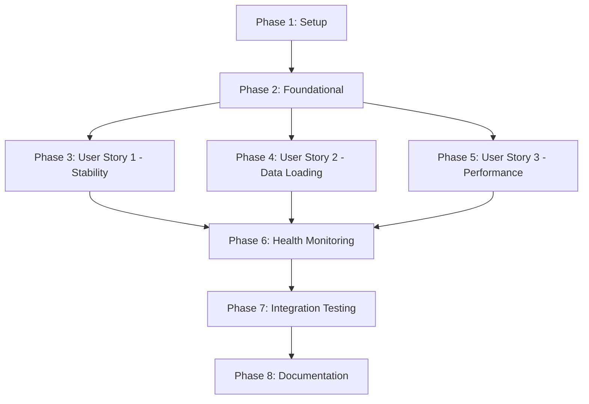

# Tasks: Backend Stability and Data Loading

**Feature**: 003-backend-stability-and-data-loading  
**Input**: Design documents from `/specs/003-backend-stability-and-data-loading/`  
**Prerequisites**: plan.md, spec.md, research.md, data-model.md, contracts/api-contracts.md, quickstart.md

**Organization**: Tasks are grouped by user story to enable independent implementation and testing of each story.

## Format: `[ID] [P?] [Story] Description`

- **[P]**: Can run in parallel (different files, no dependencies)
- **[Story]**: Which user story this task belongs to (US1, US2, US3)
- Include exact file paths in descriptions

## Path Conventions

All paths use `backend/` prefix for web application structure.

---

## Phase 1: Setup (Shared Infrastructure)

**Purpose**: Install dependencies and update project configuration

- [ ] T001 Add `psutil` to backend/requirements.txt for process metrics
- [ ] T002 [P] Update backend/.env.example with health monitoring configuration variables
- [ ] T003 [P] Update backend/src/config.py to add health monitoring settings (health_check_enabled, db_retry_max_attempts, db_retry_base_delay, startup_load_hours)

**Checkpoint**: Dependencies installed, configuration ready

---

## Phase 2: Foundational (Blocking Prerequisites)

**Purpose**: Core infrastructure that MUST be complete before ANY user story can be implemented

**⚠️ CRITICAL**: No user story work can begin until this phase is complete

- [ ] T004 Create backend/src/services/health.py with ApplicationState dataclass and global app_state singleton
- [ ] T005 [P] Create retry decorator in backend/src/services/database.py (retry_db_operation with exponential backoff)
- [ ] T006 Modify backend/src/main.py to implement FastAPI lifespan context manager with startup/shutdown hooks
- [ ] T007 [P] Add structured logging configuration in backend/src/main.py with proper context fields
- [ ] T008 Update backend/src/services/database.py to add is_connected() method for health checks
- [ ] T009 Create backend/monitoring/process_monitor.py external monitoring script (optional production tool)

**Checkpoint**: Foundation ready - user story implementation can now begin in parallel

---

## Phase 3: User Story 1 - Backend Remains Stable During Data Collection (Priority: P1) 🎯 MVP

**Goal**: Ensure backend process runs continuously without crashes during and after Reddit data collection cycles

**Independent Test**: Start backend, trigger data collection cycle, verify backend process remains running for at least 1 hour after collection completes

### Implementation for User Story 1

- [ ] T010 [P] [US1] Implement graceful shutdown in backend/src/main.py lifespan shutdown section (scheduler.shutdown(wait=True), db.disconnect())
- [ ] T011 [P] [US1] Add catch-log-continue error handling in backend/src/services/scheduler.py for data collection job (wrap per-subreddit collection in try/except)
- [ ] T012 [US1] Update backend/src/services/reddit_collector.py to apply @retry_db_operation decorator to database save operations
- [ ] T013 [US1] Add error logging with full context in backend/src/services/scheduler.py (timestamp, subreddit, error type, stack trace)
- [ ] T014 [US1] Update backend/start.sh to add process cleanup logic (pkill -f "python3 -m uvicorn" before starting)
- [ ] T015 [US1] Modify backend/src/services/scheduler.py to update app_state.collections_succeeded and app_state.collections_failed counters
- [ ] T016 [US1] Add memory monitoring in scheduler job to detect leaks (log memory usage at start/end of each collection cycle)
- [ ] T017 [US1] Test fail-fast behavior in backend/src/main.py lifespan startup (database connection failure should raise exception)

**Checkpoint**: Backend runs continuously for 24+ hours without crashes. Collection errors are logged but don't crash the process.

---

## Phase 4: User Story 2 - Previously Collected Data Loads on Startup (Priority: P1)

**Goal**: Load existing database data immediately when backend starts so users see historical sentiment analysis without waiting

**Independent Test**: Ensure database contains data from previous collections, restart backend, immediately query API, verify historical data is returned

### Implementation for User Story 2

- [ ] T018 [P] [US2] Create load_recent_data() async function in backend/src/services/database.py (queries last 24 hours of posts/comments)
- [ ] T019 [US2] Add background task launch in backend/src/main.py lifespan startup (asyncio.create_task(load_recent_data()) - non-blocking)
- [ ] T020 [US2] Update backend/src/api/routes.py GET /posts/recent endpoint to check data availability immediately (no waiting for collection)
- [ ] T021 [US2] Update backend/src/api/routes.py GET /sentiment/stats endpoint to query database for existing data on cold start
- [ ] T022 [US2] Update backend/src/api/routes.py GET /trending endpoint to return historical trending data from database
- [ ] T023 [US2] Add logging in load_recent_data() to report how many posts/comments loaded and time taken
- [ ] T024 [US2] Ensure all API endpoints handle empty database gracefully (return empty arrays/zero counts, not errors)

**Checkpoint**: Users see existing data immediately after backend restart. Dashboard displays historical data within 2 seconds.

---

## Phase 5: User Story 3 - Real-time Data Query Performance (Priority: P2)

**Goal**: Ensure API queries return results quickly even with large datasets (30+ days, millions of records)

**Independent Test**: Load database with 30 days of data, query various endpoints, verify all respond within performance thresholds

### Implementation for User Story 3

- [ ] T025 [P] [US3] Verify CosmosDB indexes exist on collected_at field in posts collection (document in data-model.md if manual setup required)
- [ ] T026 [P] [US3] Verify CosmosDB indexes exist on collected_at field in comments collection (document in data-model.md if manual setup required)
- [ ] T027 [US3] Add pagination support to backend/src/services/database.py query methods (limit parameter, default 1000)
- [ ] T028 [US3] Update backend/src/api/routes.py GET /sentiment/stats to use indexed queries with time window filters
- [ ] T029 [US3] Update backend/src/api/routes.py GET /posts/recent to use indexed queries with proper sort order
- [ ] T030 [US3] Update backend/src/api/routes.py GET /trending to use indexed queries for 7-day window analysis
- [ ] T031 [US3] Add query performance logging in backend/src/services/database.py (log query time for slow queries >1s)
- [ ] T032 [US3] Test concurrent query handling (simulate 20 concurrent users, verify all queries complete within 5s)

**Checkpoint**: All API endpoints respond within thresholds: stats <3s, posts <2s, trending <5s with 30+ days of data

---

## Phase 6: Enhanced Health Monitoring (Cross-Cutting)

**Goal**: Expose comprehensive health metrics via /health endpoint for monitoring backend stability

**Independent Test**: Query /health endpoint, verify all metrics are present and accurate

### Implementation for Health Monitoring

- [ ] T033 [P] [HEALTH] Update backend/src/api/routes.py GET /health endpoint to return process metrics using psutil
- [ ] T034 [P] [HEALTH] Add process.uptime_seconds calculation in /health endpoint (time.time() - app_state.app_start_time)
- [ ] T035 [P] [HEALTH] Add process.memory_mb calculation in /health endpoint (psutil.Process().memory_info().rss / 1024 / 1024)
- [ ] T036 [P] [HEALTH] Add process.cpu_percent calculation in /health endpoint (psutil.Process().cpu_percent(interval=0.1))
- [ ] T037 [HEALTH] Add application metrics to /health response (last_collection_at, collections_succeeded, collections_failed, data_freshness_minutes)
- [ ] T038 [HEALTH] Add database.connected status to /health response (await db.is_connected())
- [ ] T039 [HEALTH] Implement health status determination logic (healthy/degraded/unhealthy based on thresholds)
- [ ] T040 [HEALTH] Return 503 status code when status is "unhealthy" (database disconnected, memory exhausted)
- [ ] T041 [HEALTH] Update backend/src/services/scheduler.py to update app_state.last_collection_time on successful collection

**Checkpoint**: /health endpoint returns comprehensive metrics. Monitoring tools can detect degraded/unhealthy states.

---

## Phase 7: Integration Testing (Validation)

**Purpose**: Validate all user stories work together and meet success criteria

- [ ] T042 [P] Create backend/tests/integration/test_backend_stability.py for 24-hour stability test
- [ ] T043 [P] Create backend/tests/integration/test_data_loading.py for startup data availability test
- [ ] T044 [P] Create backend/tests/integration/test_query_performance.py for performance threshold validation
- [ ] T045 Add test scenario: Backend runs 10 consecutive collection cycles without memory leaks (SC-004)
- [ ] T046 Add test scenario: Health endpoint reports "healthy" status with uptime >23 hours (SC-007)
- [ ] T047 Add test scenario: Zero orphaned processes after 20 code reload cycles (SC-008)
- [ ] T048 Add test scenario: Backend handles 5 different error types without crashing (SC-006)
- [ ] T049 [P] Create backend/tests/unit/test_health_service.py for ApplicationState unit tests
- [ ] T050 [P] Create backend/tests/unit/test_error_recovery.py for retry decorator unit tests

**Checkpoint**: All integration tests pass. Success criteria SC-001 through SC-008 are validated.

---

## Phase 8: Documentation & Polish

**Purpose**: Finalize documentation and deployment configurations

- [ ] T051 [P] Update deployment/systemd/sentimentagent.service with proper Restart and RestartSec configuration
- [ ] T052 [P] Create TROUBLESHOOTING.md section for backend stability debugging (if not already exists, merge with existing)
- [ ] T053 [P] Update README.md with health monitoring endpoint documentation
- [ ] T054 Add logging best practices documentation in backend/README.md (structured logging, error context)
- [ ] T055 [P] Create runbook for production: "What to do when backend crashes" in deployment/RUNBOOK.md
- [ ] T056 Verify all file paths in quickstart.md match actual implementation

**Checkpoint**: Documentation complete, production-ready deployment configuration

---

## Dependencies

### User Story Dependencies



### Task Dependencies Within Phases

**Phase 2 (Foundational)**:

- T006 (lifespan) depends on T004 (ApplicationState)
- T007 (logging) can run parallel with T004-T006
- T005, T008, T009 can all run in parallel

**Phase 3 (US1)**:

- T010, T011 can run in parallel (different files)
- T012 depends on T005 (retry decorator)
- T015 depends on T011 (scheduler modifications)
- T013, T014, T016, T017 can run in parallel

**Phase 4 (US2)**:

- T018 can run in parallel with T019-T024 (preparation)
- T020, T021, T022 can run in parallel (different endpoints)
- T019 depends on T018 (uses load_recent_data function)

**Phase 5 (US3)**:

- T025, T026 can run in parallel (different collections)
- T028, T029, T030 can run in parallel (different endpoints)
- T027, T031 can run in parallel with endpoint updates

**Phase 6 (Health)**:

- T033, T034, T035, T036 can all run in parallel (different metrics)
- T037 depends on T034-T036 (assembles metrics)
- T039 depends on T037 (uses assembled data)
- T041 depends on T015 (scheduler counter updates)

**Phase 7 (Testing)**:

- T042, T043, T044 can run in parallel (different test files)
- T045-T048 can run in parallel (different test scenarios)
- T049, T050 can run in parallel (different unit test files)

**Phase 8 (Documentation)**:

- T051, T052, T053, T055 can all run in parallel (different files)
- T056 should run after all implementation complete

---

## Parallel Execution Examples

### Phase 2 Parallel Execution

```bash
# 3 developers can work simultaneously
Developer 1: T004 (health service) + T006 (lifespan)
Developer 2: T005 (retry decorator) + T008 (db.is_connected)
Developer 3: T007 (logging) + T009 (monitoring script)
```

### Phase 3 Parallel Execution

```bash
# 2-3 developers can work simultaneously
Developer 1: T010 (graceful shutdown) + T014 (start.sh)
Developer 2: T011 (error handling) + T013 (logging)
Developer 3: T012 (retry decorator usage) + T016 (memory monitoring)
```

### Phase 4 Parallel Execution

```bash
# 3 developers can work simultaneously
Developer 1: T018 (load_recent_data) + T023 (logging)
Developer 2: T020 (posts endpoint) + T021 (stats endpoint)
Developer 3: T022 (trending endpoint) + T024 (error handling)
```

### Phase 6 Parallel Execution

```bash
# 3 developers can work simultaneously
Developer 1: T033-T036 (process metrics)
Developer 2: T037-T038 (application & database metrics)
Developer 3: T039-T040 (health status logic)
```

---

## Implementation Strategy

### MVP Scope (Minimum Viable Product)

**Recommended MVP**: User Story 1 ONLY (Backend Stability)

**Phases for MVP**:

- Phase 1: Setup (T001-T003)
- Phase 2: Foundational (T004-T009)
- Phase 3: User Story 1 (T010-T017)
- Phase 6: Basic Health Monitoring (T033-T041)
- Phase 7: Stability Tests Only (T042, T045, T046, T047, T048)

**MVP Success Criteria**:

- Backend runs 24 hours without crashes (SC-001)
- Collection errors logged but don't crash process (SC-006)
- Health endpoint shows uptime and collection status (SC-007)

**Time Estimate**: 2-3 days with 2 developers

---

### Full Feature Scope

**All User Stories**: US1 (Stability) + US2 (Data Loading) + US3 (Performance)

**Phases**:

- Phase 1-8 complete

**Success Criteria**: All SC-001 through SC-008

**Time Estimate**: 5-7 days with 2-3 developers

---

### Incremental Delivery Plan

1. **Week 1**: Deliver MVP (US1 - Stability)
   - Phases 1, 2, 3, 6 (partial), 7 (partial)
   - Deploy to production, monitor for 24-48 hours
   - SUCCESS: Backend no longer crashes

2. **Week 2**: Add US2 (Data Loading)
   - Phase 4 complete
   - Update Phase 6 (health metrics)
   - Update Phase 7 (data loading tests)
   - Deploy to production
   - SUCCESS: Users see historical data immediately

3. **Week 3**: Add US3 (Performance)
   - Phase 5 complete
   - Performance testing and optimization
   - Deploy to production
   - SUCCESS: Queries remain fast with 30+ days data

4. **Week 4**: Polish & Production Hardening
   - Phase 8 complete
   - Load testing, monitoring setup
   - Documentation finalization
   - SUCCESS: Production-ready with runbooks

---

## Task Summary

- **Total Tasks**: 56
- **Setup/Foundational**: 9 tasks (Phases 1-2)
- **User Story 1 (Stability)**: 8 tasks (Phase 3)
- **User Story 2 (Data Loading)**: 7 tasks (Phase 4)
- **User Story 3 (Performance)**: 8 tasks (Phase 5)
- **Health Monitoring**: 9 tasks (Phase 6)
- **Integration Testing**: 9 tasks (Phase 7)
- **Documentation**: 6 tasks (Phase 8)

- **Parallelizable Tasks**: 32 tasks marked [P]
- **Sequential Tasks**: 24 tasks (due to dependencies)

---

## Validation Checklist

### Before Starting Implementation

- [ ] All design documents reviewed and approved (plan.md, spec.md, research.md, data-model.md, contracts/)
- [ ] Development environment setup (Python 3.13.3, FastAPI 0.109.2, CosmosDB emulator)
- [ ] Feature branch created: `003-backend-stability-and-data-loading`

### After Each User Story Phase

- [ ] **After Phase 3 (US1)**: Backend runs for 4+ hours without crashes
- [ ] **After Phase 4 (US2)**: API returns data immediately after restart (database has data)
- [ ] **After Phase 5 (US3)**: All API endpoints respond within thresholds with large dataset

### Before Merge to Main

- [ ] All 56 tasks completed
- [ ] All integration tests pass (Phase 7)
- [ ] Success criteria SC-001 through SC-008 validated
- [ ] Documentation complete and accurate (Phase 8)
- [ ] Code review completed
- [ ] Production deployment plan reviewed

---

## Next Steps

1. **Start with Setup**: Complete Phase 1 (T001-T003) - install psutil, update config
2. **Build Foundation**: Complete Phase 2 (T004-T009) - core infrastructure
3. **Implement MVP**: Complete Phase 3 (T010-T017) - backend stability (User Story 1)
4. **Validate MVP**: Run stability tests from Phase 7 for 24 hours
5. **If MVP succeeds**: Continue with Phase 4 (User Story 2), then Phase 5 (User Story 3)

**Recommended approach**: Implement in order, checkpoint after each phase, deploy incrementally.
